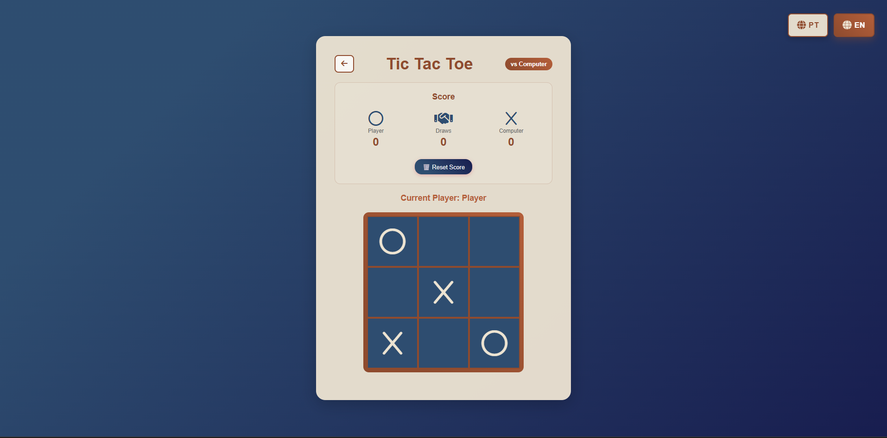

# Tic-Tac-Toe / EN

Classic Tic-Tac-Toe game with clean interface and responsive design.

Links

- Have fun now: https://fredericwithc.github.io/Tic-Tac-Toe/
- Repository: https://github.com/fredericwithc/Tic-Tac-Toe

About

A fully functional Tic-Tac-Toe game built with vanilla JavaScript. This project focuses on game logic, DOM manipulation, and creating an intuitive user interface.

Features

-  Two-player gameplay
-  Single-player mode (vs Computer AI)
-  Win detection for rows, columns, and diagonals
-  Draw detection
-  Reset game functionality
-  Responsive design for mobile and desktop
-  Clean, minimal UI

Key Learnings

- Implementing game logic with JavaScript
- Managing game state
- DOM manipulation and event handling
- Creating responsive layouts with CSS Grid/Flexbox
- Win condition algorithms

Technologies

- HTML5
- CSS3
- JavaScript

Contact

Frederic Leyenberger

- Linkedin: https://www.linkedin.com/in/frederic-leyenberger/

------------------------------------------------------------------------------------------

# Jogo da Velha / PT-BR

Jogo da Velha clássico com interface limpa e design responsivo.

Links

- Jogue agora: https://fredericwithc.github.io/Tic-Tac-Toe/
- Repositório: https://github.com/fredericwithc/Tic-Tac-Toe

Sobre o Projeto

Um jogo da velha totalmente funcional construído com JavaScript puro. Este projeto foca em lógica de jogo, manipulação do DOM e criação de uma interface intuitiva.

Funcionalidades

- Modo dois jogadores
- Modo um jogador (contra o Computador)
- Detecção de vitória para linhas, colunas e diagonais
- Detecção de empate
- Funcionalidade de reiniciar jogo
- Design responsivo para mobile e desktop
- Interface limpa e minimalista

Principais Aprendizados

- Implementação de lógica de jogo com JavaScript
- Gerenciamento de estado do jogo
- Manipulação do DOM e tratamento de eventos
- Criação de layouts responsivos com CSS Grid/Flexbox
- Algoritmos de condição de vitória

Tecnologias Utilizadas

- HTML5
- CSS3
- JavaScript

Contato

Frederic Leyenberger

- Linkedin: https://www.linkedin.com/in/frederic-leyenberger/
